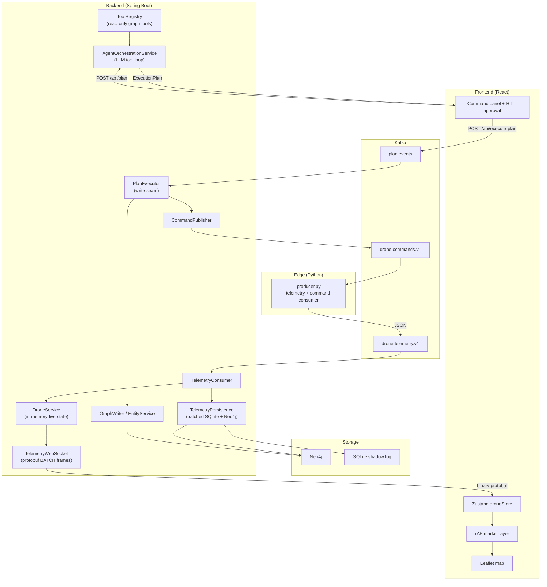

# Agentic Asset Tracker

A command-and-control dashboard for a simulated drone fleet. Type a mission in natural language, an LLM plans it taking into account the environment (configurable), you approve it, and the mission executes.

**Honest disclaimer:** This isn't solving a real problem. There's no customer, no deployment target, and no product roadmap. I built it because I thought an ops map with an agentic planner was cool, because I wanted to learn event driven systems end to end, and because I was preparing for a Palantir internship where we are doing something similar and wanted practice with the kind of work that involves: messy real-time data, graph shaped state, human-in-the-loop writes, and making expensive things cheap enough to demo.

So if you're a recruiter or engineer skimming this: the value isn't the app itself (sorry, I have some other things on my GitHub where it *does* matter so check those out!). It's the systems thinking underneath.

---

## Demo

<!-- Replace each placeholder with a GIF or short MP4 hosted on GitHub (drag into an issue/PR comment, copy URL) or link to a Loom/YouTube clip. Keep clips 15–45 seconds. -->

- **Hero (put first)**
  - Show: full screen map with ~50–100 drones roaming, side panel, mission phase chip
  - Prompt: *"Fly 6 drones in a wedge to investigate the disturbance south of the fleet"* → accept plan → watch FORM_UP → HOLD → ADVANCE → COMPLETE
- **Agent planning**
  - Show: side panel only, then expand the plan puck
  - Prompt: same as hero. Compact mission card → expand reasoning + grouped steps → Accept
- **Tool grounding** (optional)
  - Show: backend logs or a second terminal
  - Prompt: same, with `LLM_PROVIDER=anthropic`. Watch tool calls (`list_drones` → `preview_two_phase`) before the plan lands.
- **Map entities**
  - Show: toolbar + inspector
  - Do: place a hostile track, patrol zone, and waypoint. Drag one. Agent references a zone ("avoid the restricted zone, search the patrol area").
- **Scale**
  - Show: browser perf + optional backend logs
  - Run: `python3 producer.py --drones 1000 --interval 0.05`
- **Inspector**
  - Show: click a drone mid-mission
  - Drone inspector: id, battery, role, current waypoint. Drag to pin it.

```markdown
<!-- PASTE CLIPS HERE — example format:

### Mission planning (30s)


### 1000-drone scale (20s)


-->
```

**Recording tips:** 1920×1080 or 1440×900, dark UI reads well. Hide OS notifications. Use a single clean prompt per clip so the story is obvious without narration. If you add voiceover, 30 seconds is enough: "natural language in, human approves, executor fans out Kafka commands, drones form up then advance."

---

## What I Actually Built

Most portfolio maps are CRUD with dots on them. This one is a small distributed system with a deliberate split between **read** and **write** paths:

- **Edge**: Python simulator publishes telemetry and consumes motion commands
- **Stream**: Kafka topics for telemetry, commands, and approved plans
- **Backend**: Spring Boot: consume streams, hold live state, persist, broadcast
- **Graph**: Neo4j ontology (squadrons, objectives, map entities)
- **Agent**: LLM reads the graph via tools, emits an `ExecutionPlan`; never writes directly
- **Executor**: Single auditable write seam: approved plans → Neo4j + command topic
- **UI**: React + Leaflet, WebSocket-driven, human approves every plan

---

## Architecture

This mermaid chart helped me while I was building so thought I'd let you guys feast your eyes on my best creation of the whole project. 



**Data formats:** Kafka telemetry stays JSON (edge <-> backend). Browser WebSocket uses binary Protocol Buffers (`proto/telemetry.proto`) to cut parse overhead at scale.

---

## Agent / AI Engineering

This is the part I cared most about. The map and Kafka pipeline are fun infrastructure, but the agent layer is where most of the "AI engineering" (buzzword alert) decisions live: what the model can *see*, what it can *say*, and what it is physically prevented from *doing*.

### Read Only

A lot of agent demos let the LLM call write tools directly ("create squadron", "move drone"). I didn't want that. The model only gets read access to world state. It returns a typed `ExecutionPlan` (JSON with a fixed action vocabulary). A human approves it in the UI. Only then does `PlanExecutor` write to Neo4j and publish Kafka commands.

```
Operator prompt
  -> multi-turn tool loop (read graph, preview formations, discover entity ids)
  -> ExecutionPlan JSON
  -> human Accept or Reject
  -> PlanValidator (schema + policy)
  -> PlanExecutor (single write seam)
```

The LLM is a planner, not an executor. If it hallucinates an id or a bad coordinate, nothing mutates until you click Accept, and `PlanValidator` catches structural errors before Kafka sees the plan.

### Tool surface (18 read-only tools)

Tools live in `ToolRegistry` and only touch `GraphService` (reads). The registry never imports `GraphWriter`, so "the agent can't mutate" is a compile time boundary.

- **Fleet discovery**
  - Tools: `list_drones`, `get_drone_by_id`, `get_drones_in_squadron`, `get_drones_by_status`, `get_low_battery_drones`, `get_low_battery_drones_in_sector`, `get_drones_near`
  - Ground plans in real ids and positions. `list_drones` returns a compact columnar table to save tokens on large fleets.
- **Org graph**
  - Tools: `list_squadrons`, `list_objectives`, `get_squadrons_for_objective`
  - Squadron -> objective assignment is graph shaped; the agent has to discover structure before referencing it.
- **Map entities**
  - Tools: `list_tracks`, `list_waypoints`, `list_zones`, `get_*_by_id`
  - Hostile contacts, patrol areas, POIs. Lets prompts like "search the patrol zone" or "avoid the restricted area" work off real map state.
- **Formation geometry**
  - Tools: `list_formations`, `preview_formation`, `preview_two_phase`
  - Swarm math runs server-side. The model picks formation type + drone ids + AOI; the backend computes slot coordinates.


### Multi-turn orchestration

`AgentOrchestrationService` runs a capped tool-use loop (`MAX_TURNS = 6`):

1. Send system prompt + user command + tool specs to the model
2. If the model returns `tool_use`, execute tools server side, append results, loop
3. If the model returns a final answer, parse it as `ExecutionPlan` JSON
4. Validate, expand `applyFormation` macros, return to the UI

Bad JSON gets a retry (`MAX_PLAN_RETRIES = 2`) with an error message fed back to the model. Runaway loops hit the turn cap instead of billing forever.

### Provider seam + offline dev

`LlmClient` is a one-method interface. Two beans:

- **`stub`** → `StubLlmClient`
  - Deterministic offline planner. No API key. Cheap tests.
- **`anthropic`** → `AnthropicLlmClient`
  - Real Claude via Messages API. Tool specs forwarded verbatim in Anthropic's native shape.

Swapping providers is a Spring property flip (`llm.provider`), zero orchestrator changes. Prompt caching, thinking mode, and model tier are configured on the Anthropic bean only.

---

## Infra Highlights

### 1. Telemetry -> latency

Started with REST polling at 1 Hz for 50 drones. Broke immediately at 1,000 drones x 20 Hz. Needed to refactor.

What changed:
- **Edge:** fire-and-forget Kafka sends, `lz4` compression, time-based physics (same motion at 1 Hz or 20 Hz)
- **Backend:** Kafka listener never blocks on I/O; coalesced 50 ms broadcast tick; persistence on a separate batched flush queue
- **Wire:** JSON on Kafka, protobuf on the browser WebSocket
- **Frontend:** Zustand store + imperative Leaflet updates in `requestAnimationFrame` (1,000 markers never touch React reconciliation)

### 2. Agent cost: 18x reduction in per plan cost from original by doing the following

- Disabled adaptive thinking (thinking tokens bill at output rate)
- Prompt caching on system prompt + tool specs across the multi-turn loop
- `MAX_TURNS` cap on runaway tool loops
- Trimmed system prompt + compact tool outputs (columnar `list_drones`, rounded coords)
- `applyFormation` macro: ~2 LLM actions instead of ~100 per-drone `setWaypoint`s, expanded server-side

The `LlmClient` seam (`stub` vs `anthropic`) means offline dev and tests need no API key.

### 3. Human-in-the-loop C2

The LLM never writes. It reads via 18 tools, returns an `ExecutionPlan`, and waits for Accept. `PlanValidator` checks schema/policy; `PlanExecutor` is the only write path. Two-phase swarms gate ADVANCE on FORM_UP arrival in the executor, not in the model.

### 4. Graph ontology + map entities

Fleet state is a Neo4j graph (drones, squadrons, objectives), not a flat list. Persistent map annotations (hostile tracks, patrol zones, waypoints) are CRUD-able manually or via plan actions, with live WebSocket fanout.

### 5. Edge motion model

Python simulator with threaded command consumer, per-drone Kafka ordering, loiter on arrival (stable "arrived" detection), and smooth time based steering. Commands and telemetry share one process with a lock on shared state.

---

## Tech Stack

- Frontend: React, TypeScript, Vite, Leaflet, Zustand
- Backend: Java 21, Spring Boot, Kafka, Neo4j
- Edge: Python, kafka-python
- Streaming: Kafka (KRaft via Docker)
- Agent: Anthropic Claude (Haiku default), tool-use loop
- Serialization: JSON (Kafka), Protocol Buffers (WebSocket)
- Persistence: SQLite shadow log, Neo4j graph

---

## Quick Start

Full setup (Kafka, backend, edge, frontend, LLM config, scale test commands):

**[docs/RUNNING.md](docs/RUNNING.md)**

Short version:

```bash
docker compose -f infra/docker-compose.yml up -d
cd backend && ./gradlew bootRun
cd edge && source .venv/bin/activate && python3 producer.py
cd frontend && npm install && npm run dev
```

Open `http://localhost:5173`. Default planner is offline (`llm.provider=stub`). For real Claude, see RUNNING.md.

---

## Documentation

- [RUNNING.md](docs/RUNNING.md) — startup order, scale test, LLM/API key setup
- [TELEMETRY.md](docs/TELEMETRY.md) — Kafka + WebSocket wire formats
- [COMMANDS.md](docs/COMMANDS.md) — `SET_WAYPOINT` / `CLEAR_WAYPOINT` contract
- [PLAN.md](docs/PLAN.md) — `ExecutionPlan` action vocabulary
- [ONTOLOGY.md](docs/ONTOLOGY.md) — Neo4j nodes, edges, map entities
- [FORMATIONS.md](docs/FORMATIONS.md) — RING / WEDGE / LINE, two-phase swarms

---

## License

Personal learning project. Use as reference; no warranty. Don't kill my token spend please <3
