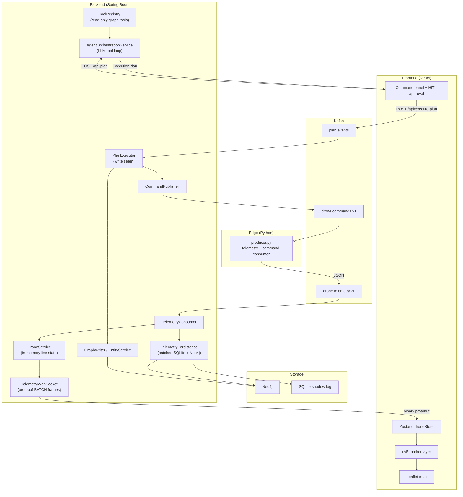

# Agentic Asset Tracker

A command-and-control dashboard for a simulated drone fleet. Type a mission in natural language, an LLM plans it, you approve it, and a thousand drones move on a live map.

> **Honest disclaimer:** This isn't solving a real problem. There's no customer, no deployment target, and no product roadmap. I built it because I thought a Starcraft-style ops map with an agentic planner was cool, because I wanted to learn event-driven systems end to end, and because I was preparing for a Palantir internship and wanted practice with the kind of work that involves: messy real-time data, graph-shaped state, human-in-the-loop writes, and making expensive things cheap enough to demo.

If you're a recruiter or engineer skimming this: the value isn't the app itself. It's the systems thinking underneath.

---

## Demo

<!-- Replace each placeholder with a GIF or short MP4 hosted on GitHub (drag into an issue/PR comment, copy URL) or link to a Loom/YouTube clip. Keep clips 15–45 seconds. -->

| Clip | What to show | Suggested prompt / action |
|------|--------------|---------------------------|
| **Hero (put first)** | Full screen: map with ~50–100 drones roaming, side panel, mission phase chip | *"Fly 6 drones in a wedge to investigate the disturbance south of the fleet"* → accept plan → watch FORM_UP → HOLD → ADVANCE → COMPLETE |
| **Agent planning** | Side panel only, then expand the plan puck | Same prompt. Show the compact mission card, expand to reveal agent reasoning + grouped steps, hit Accept |
| **Map entities** | Toolbar + inspector | Place a hostile track, a patrol zone, and a waypoint. Drag one. Show the agent referencing a zone in a plan ("avoid the restricted zone, search the patrol area") |
| **Scale** | Browser perf + optional backend logs | `python3 producer.py --drones 1000 --interval 0.05` — map stays responsive, markers moving smoothly |
| **Inspector** | Click a drone mid-mission | Drone inspector panel: id, battery, role, current waypoint. Drag to pin it |

```markdown
<!-- PASTE CLIPS HERE — example format:

### Mission planning (30s)


### 1000-drone scale (20s)


-->
```

**Recording tips:** 1920×1080 or 1440×900, dark UI reads well. Hide OS notifications. Use a single clean prompt per clip so the story is obvious without narration. If you add voiceover, 30 seconds is enough: "natural language in, human approves, executor fans out Kafka commands, drones form up then advance."

---

## What I Actually Built

Most portfolio maps are CRUD with dots on them. This one is a small distributed system with a deliberate split between **read** and **write** paths:

| Layer | What it does |
|-------|--------------|
| **Edge** | Python simulator publishes telemetry and consumes motion commands |
| **Stream** | Kafka topics for telemetry, commands, and approved plans |
| **Backend** | Spring Boot: consume streams, hold live state, persist, broadcast |
| **Graph** | Neo4j ontology (squadrons, objectives, map entities) |
| **Agent** | LLM reads the graph via tools, emits an `ExecutionPlan`; never writes directly |
| **Executor** | Single auditable write seam: approved plans → Neo4j + command topic |
| **UI** | React + Leaflet, WebSocket-driven, human approves every plan |

The agent proposes. The human approves. The executor mutates. That boundary is intentional.

---

## Architecture



**Data formats:** Kafka telemetry stays JSON (edge ↔ backend). Browser WebSocket uses binary Protocol Buffers (`proto/telemetry.proto`) to cut parse overhead at scale.

---

## Highlights (the parts worth reading about)

### 1. Telemetry → latency

Started with REST polling at 1 Hz for 50 drones. Broke immediately at 1,000 drones × 20 Hz.

What changed:
- **Edge:** fire-and-forget Kafka sends, `lz4` compression, time-based physics (same motion at 1 Hz or 20 Hz)
- **Backend:** Kafka listener never blocks on I/O; coalesced 50 ms broadcast tick; persistence on a separate batched flush queue
- **Wire:** JSON on Kafka, **protobuf** on the browser WebSocket
- **Frontend:** Zustand store + imperative Leaflet updates in `requestAnimationFrame` (1,000 markers never touch React reconciliation)

### 2. Agent cost: ~$0.92 → ~$0.05 per plan (~95% reduction)

First real Claude call on the default Sonnet path with adaptive thinking on was ~$0.92. Tuned it down to ~$0.05 without ripping out the agent:

| Lever | Effect |
|-------|--------|
| `claude-haiku-4-5` instead of Sonnet | Cheapest tier for structured tool use |
| Disabled adaptive thinking | Thinking tokens bill at output rate; off for this task |
| Prompt caching | System prompt + tool specs cached across multi-turn loop |
| `MAX_TURNS` cap | Hard stop on runaway tool loops |
| Trimmed system prompt + compact tool outputs | Less input per turn |
| `applyFormation` macro | ~2 LLM actions instead of ~100 per-drone `setWaypoint`s; expanded server-side |

The `LlmClient` seam (`stub` vs `anthropic`) means offline dev and tests need no API key.

### 3. Human-in-the-loop C2

The LLM has **read-only** tools (`list_drones`, `list_zones`, `preview_two_phase`, etc.). It returns an `ExecutionPlan`. Nothing hits Neo4j or the command bus until the operator accepts. Two-phase swarm missions gate ADVANCE on FORM_UP arrival in the executor.

### 4. Graph ontology + map entities

Fleet state is a Neo4j graph (drones, squadrons, objectives), not a flat list. Persistent map annotations (hostile tracks, patrol zones, waypoints) are CRUD-able manually or via plan actions, with live WebSocket fanout.

### 5. Edge motion model

Python simulator with threaded command consumer, per-drone Kafka ordering, loiter-on-arrival (stable "arrived" detection), and smooth time-based steering. Commands and telemetry share one process with a lock on shared state.

---

## Tech Stack

| Area | Choices |
|------|---------|
| Frontend | React, TypeScript, Vite, Leaflet, Zustand |
| Backend | Java 21, Spring Boot, Kafka, Neo4j |
| Edge | Python, kafka-python |
| Streaming | Kafka (KRaft via Docker) |
| Agent | Anthropic Claude (Haiku default), tool-use loop |
| Serialization | JSON (Kafka), Protocol Buffers (WebSocket) |
| Persistence | SQLite shadow log, Neo4j graph |

---

## Quick Start

Full setup (Kafka, backend, edge, frontend, LLM config, scale test commands):

**[docs/RUNNING.md](docs/RUNNING.md)**

Short version:

```bash
docker compose -f infra/docker-compose.yml up -d
cd backend && ./gradlew bootRun
cd edge && source .venv/bin/activate && python3 producer.py
cd frontend && npm install && npm run dev
```

Open `http://localhost:5173`. Default planner is offline (`llm.provider=stub`). For real Claude, see RUNNING.md.

---

## Documentation

| Doc | Contents |
|-----|----------|
| [RUNNING.md](docs/RUNNING.md) | Startup order, scale test, LLM/API key setup |
| [TELEMETRY.md](docs/TELEMETRY.md) | Kafka + WebSocket wire formats |
| [COMMANDS.md](docs/COMMANDS.md) | `SET_WAYPOINT` / `CLEAR_WAYPOINT` contract |
| [PLAN.md](docs/PLAN.md) | `ExecutionPlan` action vocabulary |
| [ONTOLOGY.md](docs/ONTOLOGY.md) | Neo4j nodes, edges, map entities |
| [FORMATIONS.md](docs/FORMATIONS.md) | RING / WEDGE / LINE, two-phase swarms |

---

## Project Phases (how it grew)

Built incrementally, each phase testable on its own:

1. **Foundation** — REST polling, 50 mock drones, dot on a map
2. **Streaming** — Kafka telemetry, WebSocket push, Python edge, shadow log
3. **Ontology + C2** — Neo4j graph, plan/execute loop, LLM planner, formations, HITL UI
4. **Throughput** — 1k drones, protobuf WS, batched persistence, rAF render loop
5. **Real LLM** — Anthropic integration + cost tuning (stub remains for offline dev)

---

## License

Personal learning project. Use as reference; no warranty.
