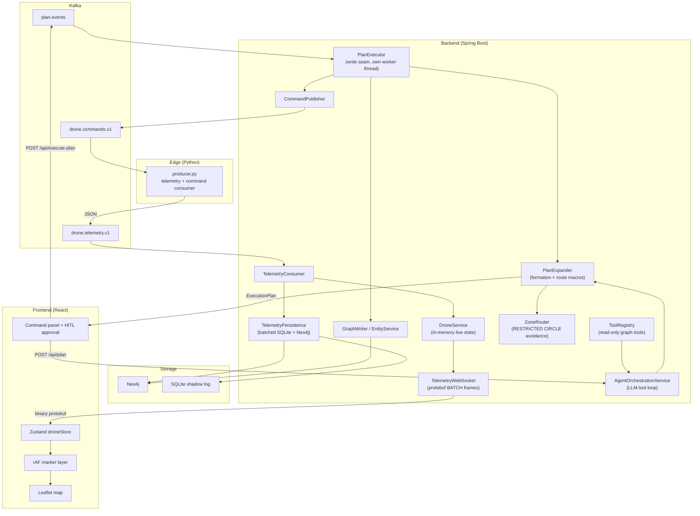

# Agentic Asset Tracker

A command-and-control dashboard for a simulated drone fleet. Type a mission in natural language, an LLM plans it taking into account the environment (configurable), you approve it, and the mission executes.

**Honest disclaimer:** This isn't solving a real problem. There's no customer, no deployment target, and no product roadmap. I built it because I thought an ops map with an agentic planner was cool, because I wanted to learn event driven systems end to end, and because I was preparing for a Palantir internship where we are doing something similar and wanted practice with the kind of work that involves: messy real-time data, graph shaped state, human-in-the-loop writes, and making expensive things cheap enough to demo.

So if you're a recruiter or engineer skimming this: the value isn't the app itself (sorry, I have some other things on my GitHub where it *does* matter so check those out!). The value is in the systems thinking underneath and what I learned and practiced with while building.

---

## Demo

Prompt: "Form up a drone swarm of 9 drones in wedge formation at waypoint `Rally`. Then, send the swarm to `Red Track 1`, all while avoiding the `Restricted Zone`"

https://github.com/user-attachments/assets/4d5cdddf-99eb-4fc1-a05b-835dab2ef435

---

## What I Actually Built

Most portfolio maps are CRUD with dots on them. This one is a small distributed system with a deliberate split between read and write paths:

- **Edge**: Python simulator publishes telemetry and consumes motion commands
- **Stream**: Kafka topics for telemetry, commands, and approved plans
- **Backend**: Spring Boot: consume streams, hold live state, persist, broadcast
- **Graph**: Neo4j ontology (squadrons, objectives, map entities)
- **Agent**: LLM reads the graph via tools, emits an `ExecutionPlan`; never writes directly
- **Executor**: Single auditable write seam: approved plans → Neo4j + command topic
- **UI**: React + Leaflet, WebSocket-driven, human approves every plan

---

## Architecture

This mermaid chart helped me while I was building so thought I'd let you guys feast your eyes on my best creation of the whole project. 


```mermaid
flowchart TB
    subgraph edge["Edge (Python)"]
        PROD["producer.py<br/>telemetry + command consumer"]
    end

    subgraph kafka["Kafka"]
        TEL["drone.telemetry.v1"]
        CMD["drone.commands.v1"]
        PLAN["plan.events"]
    end

    subgraph backend["Backend (Spring Boot)"]
        TC["TelemetryConsumer"]
        DS["DroneService<br/>(in-memory live state)"]
        TP["TelemetryPersistence<br/>(batched SQLite + Neo4j)"]
        TWS["TelemetryWebSocket<br/>(protobuf BATCH frames)"]
        AO["AgentOrchestrationService<br/>(LLM tool loop)"]
        TR["ToolRegistry<br/>(read-only graph tools)"]
        PX["PlanExpander<br/>(formation + route macros)"]
        ZR["ZoneRouter<br/>(RESTRICTED CIRCLE avoidance)"]
        PE["PlanExecutor<br/>(write seam, own worker thread)"]
        GW["GraphWriter / EntityService"]
        CP["CommandPublisher"]
    end

    subgraph store["Storage"]
        NEO["Neo4j"]
        SQL["SQLite shadow log"]
    end

    subgraph ui["Frontend (React)"]
        MAP["Leaflet map"]
        ZS["Zustand droneStore"]
        RAF["rAF marker layer"]
        PANEL["Command panel + HITL approval"]
    end

    PROD -->|JSON| TEL
    TEL --> TC --> DS
    TC --> TP --> NEO
    TP --> SQL
    DS --> TWS -->|binary protobuf| ZS --> RAF --> MAP
    PANEL -->|POST /api/plan| AO
    TR --> AO
    AO --> PX
    PX --> ZR
    PX -->|ExecutionPlan| PANEL
    PANEL -->|POST /api/execute-plan| PLAN
    PLAN --> PE
    PE --> PX
    PE --> GW --> NEO
    PE --> CP --> CMD
    CMD --> PROD
```

**Data formats:** Kafka telemetry stays JSON (edge <-> backend). Browser WebSocket uses binary Protocol Buffers (`proto/telemetry.proto`) to cut parse overhead at scale.

---

## Agent / AI Engineering

This is the part I cared most about. The map and Kafka pipeline are fun infrastructure, but the agent layer is where most of the "AI engineering" decisions live: what the model can see, what it can say, and what it is physically prevented from doing.

### Read Only

A lot of agent demos let the LLM call write tools directly ("create squadron", "move drone"). I didn't want that. The model only gets read access to world state. It returns a typed `ExecutionPlan` (JSON with a fixed action vocabulary). A human approves it in the UI. Only then does `PlanExecutor` write to Neo4j and publish Kafka commands.

```
Operator prompt
  -> multi-turn tool loop (read graph, preview formations, discover entity ids)
  -> ExecutionPlan JSON
  -> human Accept or Reject
  -> PlanValidator (schema + policy)
  -> PlanExecutor (single write seam)
```

The LLM is a planner, not an executor. If it hallucinates an id or a bad coordinate, nothing mutates until you click Accept, and `PlanValidator` catches structural errors before Kafka sees the plan.

### Tool surface (20 read-only tools)

Tools live in `ToolRegistry` and only touch `GraphService` (reads). The registry never imports `GraphWriter`, so "the agent can't mutate" is a compile time boundary.

- **Fleet discovery**
  - Tools: `list_drones`, `get_drone_by_id`, `get_drones_in_squadron`, `get_drones_by_status`, `get_low_battery_drones`, `get_low_battery_drones_in_sector`, `get_drones_near`
  - Ground plans in real ids and positions. `list_drones` returns a compact columnar table to save tokens on large fleets.
- **Org graph**
  - Tools: `list_squadrons`, `list_objectives`, `get_squadrons_for_objective`
  - Squadron -> objective assignment is graph shaped; the agent has to discover structure before referencing it.
- **Map entities**
  - Tools: `list_tracks`, `list_waypoints`, `list_zones`, `get_*_by_id`
  - Hostile contacts, patrol areas, POIs. Lets prompts like "search the patrol zone" or "avoid the restricted area" work off real map state.
- **Formation geometry**
  - Tools: `list_formations`, `preview_formation`, `preview_two_phase`
  - Swarm math runs server-side. The model picks formation type + drone ids + AOI; the backend computes slot coordinates.
- **Routing**
  - Tools: `plan_route` (single-drone `setRoute` legs)
  - Straight line when clear otherwise detours around RESTRICTED CIRCLE zones. Swarms don't call this tool at all, `applyFormationRoute` hands the model's chosen form up point and destination to the backend, which runs the same router itself and expands FORM_UP/HOLD/ADVANCE waves server side, so the model can't under specify a wave or invent detour coordinates.


### Multi-turn orchestration

`AgentOrchestrationService` runs a capped tool-use loop (`MAX_TURNS = 6`):

1. Send system prompt + user command + tool specs to the model
2. If the model returns `tool_use`, execute tools server side, append results, loop
3. If the model returns a final answer, parse it as `ExecutionPlan` JSON
4. Validate, expand `applyFormation`/`applyFormationRoute` macros, return to the UI

Bad JSON gets a retry (`MAX_PLAN_RETRIES = 2`) with an error message fed back to the model. Runaway loops hit the turn cap instead of billing forever.

### Swarm routing: one action

The model emits one `applyFormationRoute` action: formation type, drone ids, a form-up point, a destination. `PlanExpander` does the rest server side. It calls `ZoneRouter` itself and expands the result into `FORM_UP` -> `HOLD*` -> `ADVANCE` `setWaypoint` waves, one per detour leg, each wave carrying every drone id.

`ZoneRouter` avoids RESTRICTED CIRCLE zones with tangent and rim sampled candidate points computed from both the start and destination (a one sided search missed narrow "clear" windows when both ends sit close to the zone), falling back to progressively wider search radii if nothing on the buffer boundary works. Routing a formation adds a wrinkle a single point router doesn't have: a path that clears the zone for the formation's center doesn't clear it for a drone sitting hundreds of meters off to the side. `PlanExpander` inflates every obstacle by the formation's own footprint radius before routing, so the whole formation, not just its center, keeps the router's clearance margin.

### Provider seam + offline dev

`LlmClient` is a one-method interface. Two beans:

- **`stub`** → `StubLlmClient`
  - Deterministic offline planner. No API key. Cheap tests.
- **`anthropic`** → `AnthropicLlmClient`
  - Real Claude via Messages API. Tool specs forwarded verbatim in Anthropic's native shape.

Swapping providers is a Spring property flip (`llm.provider`), zero orchestrator changes. Prompt caching, thinking mode, and model tier are configured on the Anthropic bean only.

---

## Infra Highlights

### 1. Telemetry -> latency

Started with REST polling at 1 Hz for 50 drones. Broke immediately at 1,000 drones x 20 Hz. Needed to refactor.

What changed:
- **Edge:** fire-and-forget Kafka sends, `lz4` compression, time-based physics (same motion at 1 Hz or 20 Hz)
- **Backend:** Kafka listener never blocks on I/O; coalesced 50 ms broadcast tick; persistence on a separate batched flush queue
- **Wire:** JSON on Kafka, protobuf on the browser WebSocket
- **Frontend:** Zustand store + imperative Leaflet updates in `requestAnimationFrame` (1,000 markers never touch React reconciliation)

### 2. Agent cost: 18x reduction in per plan cost from original by doing the following

- Disabled adaptive thinking (thinking tokens bill at output rate)
- Prompt caching on system prompt + tool specs across the multi-turn loop
- `MAX_TURNS` cap on runaway tool loops
- Trimmed system prompt + compact tool outputs (columnar `list_drones`, rounded coords)
- `applyFormation` macro: ~2 LLM actions instead of ~100 per-drone `setWaypoint`s, expanded server-side

The `LlmClient` seam (`stub` vs `anthropic`) means offline dev and tests need no API key.

### 3. Human-in-the-loop C2

The LLM never writes. It reads via 20 tools, returns an `ExecutionPlan`, and waits for Accept. `PlanValidator` checks schema/policy; `PlanExecutor` is the only write path. Two phase swarms gate each wave on the previous wave's arrival in the executor, not in the model, and restricted zone avoidance is server side and deterministic on both the single drone and swarm paths

### 4. Plan execution never blocks the Kafka consumer

`PlanExecutor.execute()` waits for real drone arrivals between waves, so a multi-wave plan can take minutes end to end. That can't run on the `@KafkaListener` thread itself: block it too long and the broker decides the consumer is dead, revokes the partition, and redelivers the same (still uncommitted) message once polling resumes, silently replaying an in progress plan from FORM_UP while drones are already mid mission. `onPlanEnvelope` now hands off to a dedicated worker thread and returns immediately, so the listener thread stays free to keep polling.

### 5. Graph ontology + map entities

Fleet state is a Neo4j graph (drones, squadrons, objectives), not a flat list. Persistent map annotations (hostile tracks, patrol zones, waypoints) are CRUD-able manually or via plan actions, with live WebSocket fanout.

### 6. Edge motion model

Python simulator with threaded command consumer, per-drone Kafka ordering, loiter on arrival (stable "arrived" detection), and smooth time based steering. Commands and telemetry share one process with a lock on shared state.

---

## Tech Stack

- Frontend: React, TypeScript, Vite, Leaflet, Zustand
- Backend: Java 21, Spring Boot, Kafka, Neo4j
- Edge: Python, kafka-python
- Streaming: Kafka (KRaft via Docker)
- Agent: Anthropic Claude (Haiku default), tool-use loop
- Serialization: JSON (Kafka), Protocol Buffers (WebSocket)
- Persistence: SQLite shadow log, Neo4j graph

---

## Quick Start

Full setup (Kafka, backend, edge, frontend, LLM config, scale test commands):

**[docs/RUNNING.md](docs/RUNNING.md)**

Short version:

```bash
docker compose -f infra/docker-compose.yml up -d
cd backend && ./gradlew bootRun
cd edge && source .venv/bin/activate && python3 producer.py
cd frontend && npm install && npm run dev
```

Open `http://localhost:5173`. Default planner is offline (`llm.provider=stub`). For real Claude, see RUNNING.md.

---

## Documentation

- [RUNNING.md](docs/RUNNING.md) — startup order, scale test, LLM/API key setup
- [TELEMETRY.md](docs/TELEMETRY.md) — Kafka + WebSocket wire formats
- [COMMANDS.md](docs/COMMANDS.md) — `SET_WAYPOINT` / `CLEAR_WAYPOINT` contract
- [PLAN.md](docs/PLAN.md) — `ExecutionPlan` action vocabulary
- [ONTOLOGY.md](docs/ONTOLOGY.md) — Neo4j nodes, edges, map entities
- [FORMATIONS.md](docs/FORMATIONS.md) — RING / WEDGE / LINE, two-phase swarms

---

## License

Personal learning project. Use as reference; no warranty.
